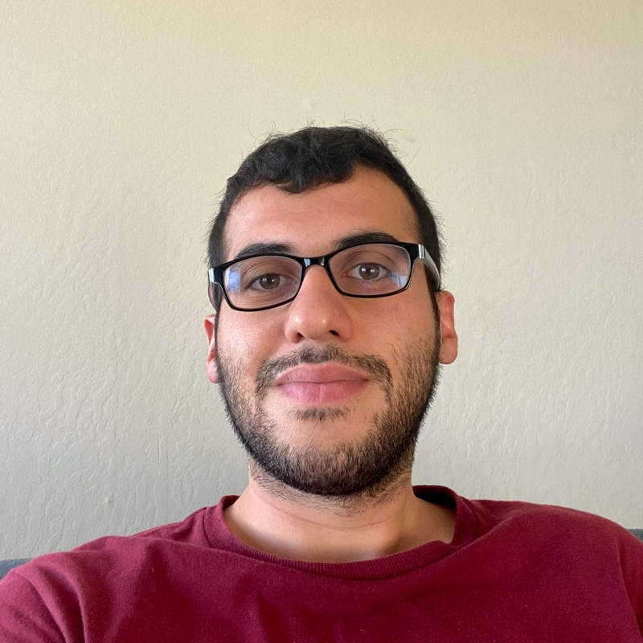

# Hello!

Welcome to my minimal academic homepage :)
   
My name is Saeed Najafi and I am a second-year Ph.D. student under the supervision of Dr. [Alona Fyshe](https://webdocs.cs.ualberta.ca/~alona/) at the University of Alberta.
 
I am currently investigating how to generate automatic questions for unseen relations for the task of zero-shot relation extraction. We wish to transfer the power of pre-trained QA models into the task of relation extraction.
   
Previously, I worked at [BenchSci](https://www.benchsci.com/) as an ML engineer (2018-2020).
I also obtained my M.Sc. in Computing Science at the University of Alberta where I started my
research in NLP under the supervision of the Professors [Colin Cherry](https://sites.google.com/site/colinacherry/) and [Greg Kondrak](https://webdocs.cs.ualberta.ca/~kondrak/). My M.Sc. [thesis](https://github.com/SaeedNajafi/ac-tagger/blob/master/saeed-thesis-tosubmit.pdf) was about the application of reinforcement learning to resolve the exposure bias in sequence labeling models.
 
Before joining UofA, I did my B.Sc. in Software Engineering at the Amirkabir University of Technology, Iran (2012-2016).
   

You can find my latest CV [here](https://github.com/SaeedNajafi/saeednajafi.github.io/blob/master/cv.pdf).
 
I always welcome new opportunities! Please feel free to contact me if you have any questions.
